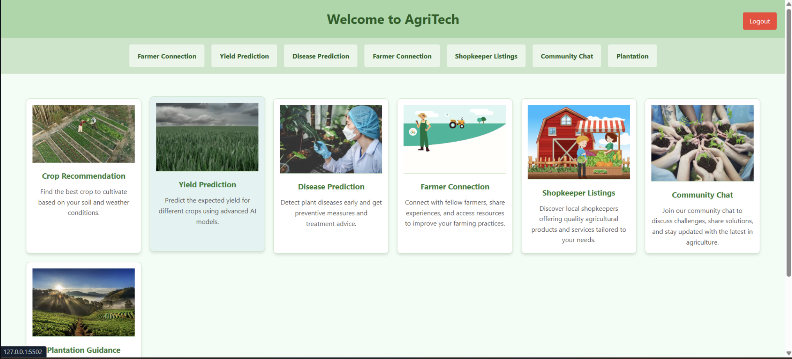
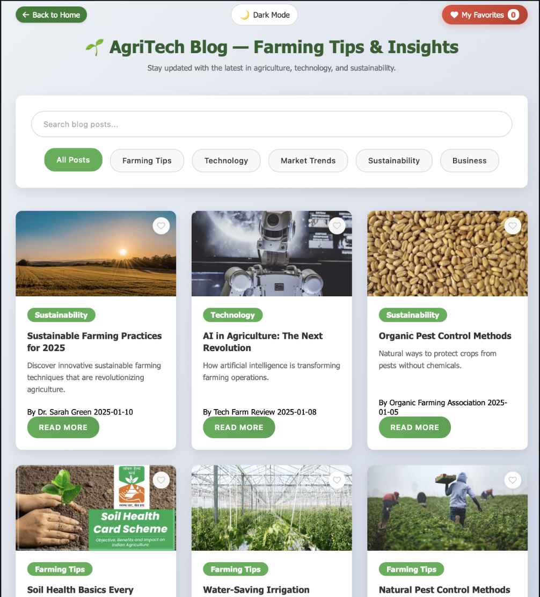
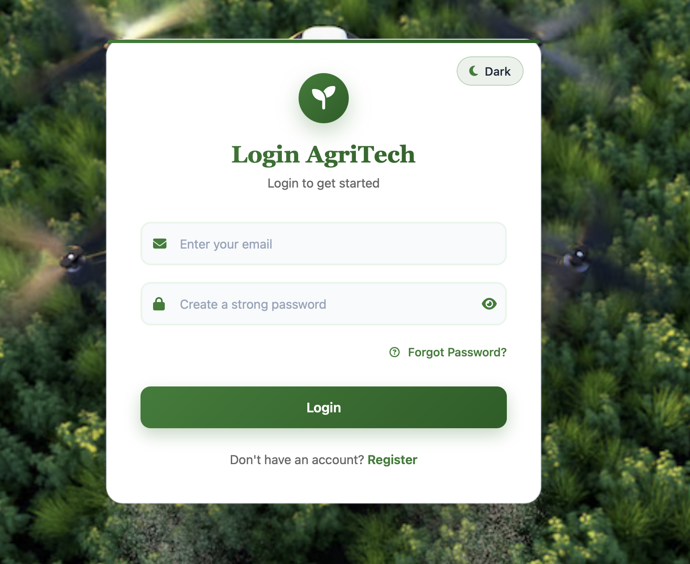
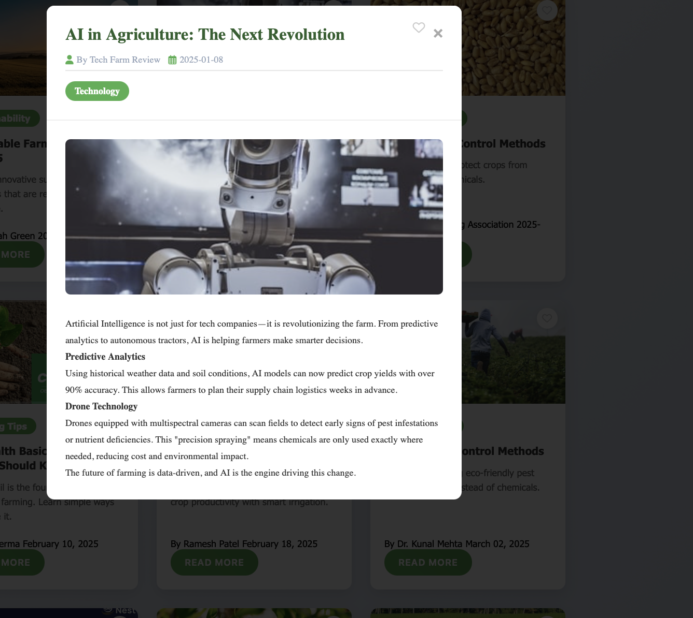

# 🌱 AgriTech — Smart Farming Solutions


[](https://swoc.tech)
[](LICENSE)
[](CONTRIBUTING.md)

**AgriTech** is an AI-powered smart agriculture platform designed to assist farmers with crop
recommendations, yield prediction, plant disease detection, and community-driven collaboration—enabling sustainable and data-driven farming practices.

---

## 📌 Overview

- AI-driven decision support for modern agriculture
- Early-stage plant disease detection
- Crop yield forecasting using machine learning models
- Collaborative ecosystem for farmers and stakeholders

---

## 🚀 Quick Start

### 1️⃣ Clone the Repository

```bash
git clone https://github.com/omroy07/AgriTech.git
cd AgriTech
```

### 2️⃣ Run Backend (Primary – Flask)

```bash
pip install -r requirements.txt
python app.py
```

**Backend URL:**

```bash
http://localhost:5000
```

**🔍 Backend Health Check**

```bash
GET http://localhost:5000/health
```

**Expected response:**

```bash
{ "status": "ok" }
```

**3️⃣ Run Frontend**

```bash
cd src/frontend
python -m http.server 8000
```

**Frontend URL:**

```bash
http://localhost:8000
```

Note: Backend and frontend must be running simultaneously for proper functionality.

---

## 🖥️ Application Preview







---


## 🏗️ System Architecture

1. **User Input:** Soil data and plant images
2. **Backend Processing:** Flask APIs and model routing
3. **ML Inference:**
   - CNNs for disease detection
   - Random Forest / XGBoost for crop recommendation
   - Regression models for yield prediction
4. **Output:** Predictions with insights and actions

---

## 🌟 Core Features

- 🌾 Crop Recommendation
- 📉 Yield Prediction
- 🔬 Disease Detection
- 🤝 Farmer Community
-  🛒 Shopkeeper Listings

---
## 🛠️ Tech Stack

### 🎨 Frontend
- HTML5
- CSS3
- JavaScript (ES6)

### ⚙️ Backend
- Python (Flask)
- Node.js (Optional)

### 🤖 Machine Learning
- TensorFlow
- Scikit-learn
- OpenCV

### 🗄️ Database & DevOps
- MySQL
- MongoDB
- Firebase
- Docker
- GitHub Actions


---

## 📂 Project Structure

```text
AGRITECH/
├── app.py                      # 🐍 Flask Backend (Main entry point)
├── server.js                   # 🟢 Node.js Server (Optional)
├── requirements.txt            # Python dependencies
├── firebase.js                 # Firebase config fetching
├── 📁 src/
│   └── 📁 frontend/            # 🌐 Frontend UI (HTML, CSS, JS)
│       ├── 📁 pages/           # Individual page files
│       ├── 📁 css/             # Stylesheets
│       └── 📁 js/              # Client-side scripts
├── 📁 crop-recommendation/   # 🌾 Crop recommendation module
├── 📁 disease-prediction/     # 🔬 Disease detection module
├── 📁 crop-yield-prediction/   # 📊 Yield forecasting module
├── 📁 community/               # 💬 community/forum backend
├── 📁 images/                  # 📸 Screenshots and assets
├── 📄 README.md                # This file
└── 📄 CONTRIBUTING.md          # Contribution guidelines
```

---

### Backend vs Frontend

- **Backend** (`app.py` at root): Flask server handling APIs, Firebase config
- **Frontend** (`src/frontend/`): Static HTML/CSS/JS served via Python HTTP server
- **Optional Node Server** (`server.js`): Alternative chat backend (not required)

---

## 🔐 Security & Reliability

- Image sanitization using OpenCV
- Secrets stored in `.env` files
- ML models evaluated using standard performance metrics (accuracy varies by model and dataset)

---

### ⚙️ Environment Variables

```bash
GEMINI_API_KEY=your_api_key
FIREBASE_API_KEY=your_key
FIREBASE_AUTH_DOMAIN=your_project.firebaseapp.com
FIREBASE_PROJECT_ID=your_project_id
FIREBASE_STORAGE_BUCKET=your_bucket.appspot.com
FIREBASE_MESSAGING_SENDER_ID=your_sender_id
FIREBASE_APP_ID=your_app_id
FIREBASE_MEASUREMENT_ID=your_measurement_id
```

---

## 🛣️ Roadmap

- Cloud Deployment
- Mobile Application
- Real-Time Weather API
- AI Chatbot
- Multilingual Support

---

## 🤝 Contribution Flow

```bash
Fork → Clone → Branch → Commit → Push → Pull Request → Review → Merge
```

 Read **[CONTRIBUTING.md](CONTRIBUTING.md)** for SWoC 2026 guidelines.


---

## 👥 Team

| Name                    | Role                    |
|-------------------------|-------------------------|
| Om Roy                  | Project Lead · Web · ML |
| Kanisha Ravindra Sharma | ML · Backend            |
| Shubhangi Roy           | ML · Backend            |


---

## 🤝 Contributing & Support

We love contributions! Please read our **[CONTRIBUTING.md](./CONTRIBUTING.md)** to get started with **SWoC 2026** tasks. Whether it's fixing bugs, adding features, or improving documentation, your help is always welcome!

---

## ✨ Contributors

#### Thanks to all the wonderful people contributing to this project! 💖


[View full contribution graph](https://github.com/omroy07/AgriTech/graphs/contributors)

---

**Made with ❤️ by the AgriTech Community — SWoC 2026**
